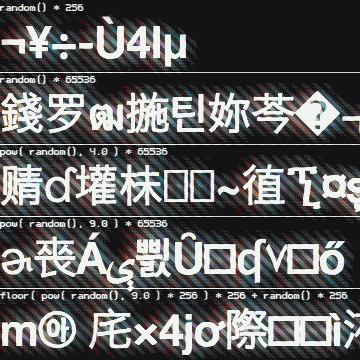
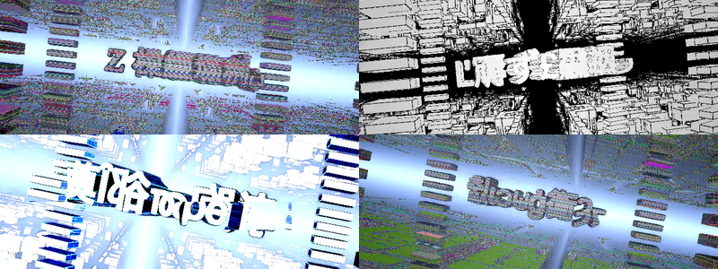

# Everyday One Motion - 20160303 "Random Unicode Generator"  

  

JavaScript, Canvas, WebGL  

[Everyday One Motion](http://motions.work/motion/132)  
[Demo Page](http://fms-cat.github.io/eom_20160303)  

## Random Unicode Generator  

今月は [ Type ] 特集です。  

  

初回は、終盤のグリッチの箇所に登場する文字の生成についてです。  
さまざまな文字を表示していますが、これはUnicodeの文字の中からランダムに引っ張ってきた文字を表示しています。  

  

## String.fromCharCode, String.fromCodePoint

[ Type ] では、 `String.fromCharCode` というJavaScriptの関数を使って、0から65535までのUnicode値(Number)を文字(String)へ変換して様々な文字を表示しています。  
このGIFでも同様に `String.fromCharCode` を使って65536番目までの文字をランダムに表示しています。  

## 漢字 vs `pow`

しかし、クソ真面目に0から65536までの乱数を取得してUnicode値から文字を取り出すと、妙に漢字やハングルが多く取り出されてしまいます。  
これは、Unicode文字全体の中でも、漢字やハングルの占める割合が多いからです。  
なので、 `pow` 関数を使って出現確率に簡単にウェイトを掛けるということを行っています。  
ランダム関数は0.0-1.0のランダムな数を返すので、そこに対して `pow` 関数で4乗や9乗をしてやれば、出てくる数字は0.0側にウェイトがかかります。  

## Control Character vs `floor`

ただ、あまり強く `pow` でウェイトをかけ過ぎると、序盤の 0-31 の、文字として意味を成さない Control Character という文字がたくさん取り出されてしまいます。  
そこで、GIFのうち一番下の手法では、全65536文字を256個の256文字で構成されるセグメントに分割し、まず最初に `pow` をかけたランダム関数でセグメントを選択し、その後に普通のランダム関数でセグメント内から文字を選択する、という処理を行っています。   

実際の [ Type ] では、 `floor` の手法は使わず、単純に `pow` で4乗しただけのランダム関数で文字を選択しています。（GIFの真ん中の手法と同じ）  
